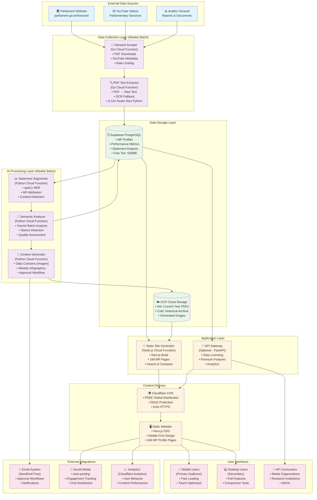
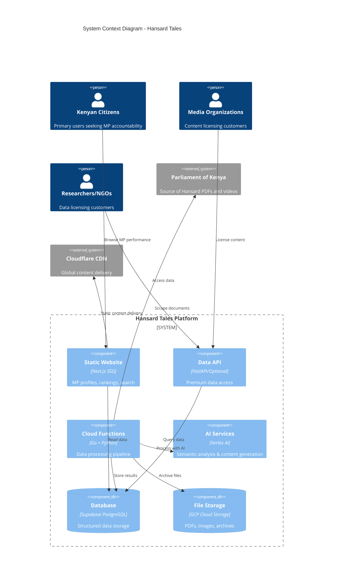

# Hansard Tales - System Architecture

## Architecture Overview (GCP Batch Approach)



## Data Processing Pipeline

```mermaid
flowchart TD
    subgraph "Weekly Batch Job Triggered Every Sunday 2 AM EAT"
        START([⏰ Cloud Scheduler Trigger])
        
        subgraph "Stage 1: Data Collection (Go)"
            DISCOVER[🔍 Discover New Sessions<br/>• Scrape parliament.go.ke<br/>• Extract PDF & YouTube URLs<br/>• Update session registry]
            DOWNLOAD[📥 Download PDFs<br/>• Parallel downloads<br/>• Resume interrupted<br/>• Store in Cloud Storage]
            EXTRACT[📄 Extract Text<br/>• Go unipdf library<br/>• OCR fallback (Vision API)<br/>• Clean & structure text]
        end
        
        subgraph "Stage 2: AI Processing (Python)"
            SEGMENT[✂️ Statement Segmentation<br/>• spaCy sentence splitting<br/>• Speaker identification<br/>• Context windows]
            BATCH[📦 Create Analysis Batches<br/>• Group 25 statements<br/>• Add session context<br/>• Optimize for Gemini]
            ANALYZE[🧠 Semantic Analysis<br/>• Gemini Flash batch calls<br/>• Context understanding<br/>• Stance + Quality scoring]
        end
        
        subgraph "Stage 3: Content Generation (Python)"
            METRICS[📊 Calculate Metrics<br/>• MP performance scores<br/>• Attendance rates<br/>• Quality rankings]
            CARTOONS[🎨 Generate Cartoons<br/>• AI find ridiculous quotes<br/>• Imagen generation<br/>• Email approval queue]
            INFOGRAPHICS[📈 Create Infographics<br/>• Corruption cost calculations<br/>• Kenyan equivalences<br/>• Visual templates]
        end
        
        subgraph "Stage 4: Site Generation (Node.js)"
            BUILD[🔧 Build Static Site<br/>• Generate 349 MP pages<br/>• Update rankings<br/>• Create search indices]
            DEPLOY[🚀 Deploy to CDN<br/>• Cloudflare Pages<br/>• Invalidate cache<br/>• Update social media]
        end
        
        ERROR_HANDLER{❌ Error Handler}
        NOTIFY[📧 Completion Notification]
    end
    
    START --> DISCOVER
    DISCOVER --> DOWNLOAD
    DOWNLOAD --> EXTRACT
    
    EXTRACT --> SEGMENT
    SEGMENT --> BATCH
    BATCH --> ANALYZE
    
    ANALYZE --> METRICS
    ANALYZE --> CARTOONS
    ANALYZE --> INFOGRAPHICS
    
    METRICS --> BUILD
    CARTOONS --> BUILD
    INFOGRAPHICS --> BUILD
    
    BUILD --> DEPLOY
    DEPLOY --> NOTIFY
    
    %% Error flows
    DISCOVER -.-> ERROR_HANDLER
    DOWNLOAD -.-> ERROR_HANDLER
    EXTRACT -.-> ERROR_HANDLER
    SEGMENT -.-> ERROR_HANDLER
    BATCH -.-> ERROR_HANDLER
    ANALYZE -.-> ERROR_HANDLER
    METRICS -.-> ERROR_HANDLER
    CARTOONS -.-> ERROR_HANDLER
    INFOGRAPHICS -.-> ERROR_HANDLER
    BUILD -.-> ERROR_HANDLER
    
    ERROR_HANDLER --> NOTIFY
    
    classDef trigger fill:#ffeb3b
    classDef collection fill:#4fc3f7
    classDef ai fill:#ab47bc
    classDef content fill:#66bb6a
    classDef deploy fill:#ff7043
    classDef error fill:#ef5350
    
    class START trigger
    class DISCOVER,DOWNLOAD,EXTRACT collection
    class SEGMENT,BATCH,ANALYZE ai
    class METRICS,CARTOONS,INFOGRAPHICS content
    class BUILD,DEPLOY deploy
    class ERROR_HANDLER,NOTIFY error
```

## Cost Breakdown Architecture

```mermaid
graph LR
    subgraph "Monthly Costs (GCP Batch Approach)"
        subgraph "GCP Services - £150-260/month"
            CF["☁️ Cloud Functions<br/>£20-40/month<br/>• Go PDF Processing<br/>• Python AI/ML<br/>• Free tier covers dev"]
            
            STORAGE["💾 Cloud Storage<br/>£10-20/month<br/>• Standard: £10-15<br/>• Coldline Archive: £5-10"]
            
            AI["🤖 Vertex AI<br/>£120-200/month<br/>• Semantic Analysis: £100-150<br/>• Cartoons: £10-20<br/>• Infographics: £10-20"]
        end
        
        subgraph "Third-Party - £1-26/month"
            CDN["🌍 Cloudflare<br/>£0 (FREE)<br/>• Static hosting<br/>• Global CDN<br/>• DDoS protection"]
            
            DB["🗄️ Supabase<br/>£0-25/month<br/>• Free: 500MB<br/>• Paid: £25 if needed"]
            
            DOMAIN["🌐 Domain + Email<br/>£1/month<br/>• .ke domain<br/>• SendGrid free tier"]
        end
    end
    
    subgraph "Total Cost by Phase"
        PHASE1["📈 Phase 1 (Months 1-3)<br/>£151-286/month<br/>⚠️ Exceeds budget by £50-80<br/>Necessary for system building"]
        
        PHASE2["📉 Phase 2 (Months 4-6)<br/>£90-180/month<br/>✅ Within budget<br/>Hierarchical filtering active"]
        
        PHASE3["🎯 Phase 3 (Months 7+)<br/>£70-140/month<br/>✅ Well within budget<br/>Custom models + optimization"]
    end
    
    classDef expensive fill:#ffcdd2
    classDef acceptable fill:#c8e6c9
    classDef free fill:#e8f5e8
    classDef phase1 fill:#ffeb3b
    classDef phase2 fill:#4caf50
    classDef phase3 fill:#2e7d32
    
    class AI expensive
    class CF,STORAGE,DB acceptable  
    class CDN,DOMAIN free
    class PHASE1 phase1
    class PHASE2 phase2
    class PHASE3 phase3
```

## Infrastructure Components



---

## Deployment Architecture

```mermaid
graph TB
    subgraph "Development Environment"
        DEV_REPO["💻 Local Development<br/>• Monorepo structure<br/>• Docker compose<br/>• Local testing"]
    end
    
    subgraph "CI/CD Pipeline"
        GIT["📚 GitHub Repository<br/>• Monorepo<br/>• Branch protection<br/>• Automated workflows"]
        
        subgraph "GitHub Actions"
            LINT["🔍 Code Quality<br/>• ESLint, Prettier<br/>• Go fmt, vet<br/>• Python black, flake8"]
            TEST["🧪 Automated Tests<br/>• Unit tests<br/>• Integration tests<br/>• End-to-end tests"]
            BUILD["🏗️ Build Process<br/>• Frontend build<br/>• Function packaging<br/>• Container images"]
        end
    end
    
    subgraph "Production Infrastructure (GCP)"
        subgraph "Compute"
            CF_GO["⚡ Cloud Functions (Go)<br/>• hansard-scraper<br/>• pdf-processor<br/>• text-extractor"]
            CF_PY["🐍 Cloud Functions (Python)<br/>• semantic-analyzer<br/>• content-generator<br/>• metrics-calculator"]
            CF_JS["📄 Cloud Functions (Node.js)<br/>• site-generator<br/>• api-gateway (optional)"]
        end
        
        subgraph "Storage & Data"
            GCS["📦 Cloud Storage<br/>• Bucket: hansard-pdfs<br/>• Bucket: generated-content<br/>• Lifecycle policies"]
            SUPABASE[(🐘 Supabase PostgreSQL<br/>• Free tier: 500MB<br/>• Auto-backups<br/>• REST API)]
        end
        
        subgraph "AI & ML"
            VERTEX["🤖 Vertex AI<br/>• Gemini Flash (bulk analysis)<br/>• Imagen 3 (cartoons)<br/>• Custom models (future)"]
        end
        
        subgraph "Orchestration"
            SCHEDULER["⏰ Cloud Scheduler<br/>• Weekly batch trigger<br/>• Error retry logic<br/>• Monitoring alerts"]
        end
    end
    
    subgraph "Content Delivery"
        CF_CDN["🌍 Cloudflare<br/>• Free hosting<br/>• Global CDN<br/>• DDoS protection<br/>• SSL/TLS"]
        
        subgraph "Monitoring"
            ANALYTICS["📊 Analytics<br/>• Cloudflare Analytics<br/>• Google Analytics<br/>• Custom metrics"]
            ALERTS["🚨 Monitoring<br/>• GCP Logging<br/>• Error tracking<br/>• Cost alerts"]
        end
    end
    
    %% Development Flow
    DEV_REPO --> GIT
    GIT --> LINT
    LINT --> TEST
    TEST --> BUILD
    
    %% Deployment Flow  
    BUILD --> CF_GO
    BUILD --> CF_PY
    BUILD --> CF_JS
    BUILD --> CF_CDN
    
    %% Data Flow
    CF_GO --> GCS
    CF_GO --> SUPABASE
    CF_PY --> VERTEX
    CF_PY --> SUPABASE
    CF_JS --> SUPABASE
    CF_JS --> CF_CDN
    
    %% Orchestration
    SCHEDULER --> CF_GO
    SCHEDULER --> CF_PY
    SCHEDULER --> CF_JS
    
    %% Monitoring
    CF_GO --> ALERTS
    CF_PY --> ALERTS
    CF_JS --> ALERTS
    CF_CDN --> ANALYTICS
    
    classDef dev fill:#e3f2fd
    classDef cicd fill:#f3e5f5
    classDef compute fill:#e8f5e8
    classDef storage fill:#fff3e0
    classDef ai fill:#fce4ec
    classDef delivery fill:#f1f8e9
    classDef monitoring fill:#fff8e1
    
    class DEV_REPO dev
    class GIT,LINT,TEST,BUILD cicd
    class CF_GO,CF_PY,CF_JS,SCHEDULER compute
    class GCS,SUPABASE storage
    class VERTEX ai
    class CF_CDN,WEBSITE delivery
    class ANALYTICS,ALERTS monitoring
