# GCP Optimized Architecture - Cost-Effective Implementation

## Executive Summary
Optimized GCP architecture for Hansard Tales that reduces Phase 1 costs from £151-286/month to £75-120/month through intelligent service selection, usage optimization, and phased feature rollout.

**Key Optimizations**:
- **Phase 1 Cost Reduction**: 50-60% savings through service optimization
- **Hierarchical AI Analysis**: 80-95% cost reduction on semantic analysis
- **Free Tier Maximization**: Aggressive use of GCP free tiers
- **Phased Feature Rollout**: Start minimal, add features as revenue grows

**Final Cost**: £75-120/month (Phase 1) → £70-140/month (Optimized)

---

## 1. COST OPTIMIZATION STRATEGIES

### 1.1 Service-by-Service Optimization

#### **Vertex AI Cost Reduction (Primary Cost Driver)**
```yaml
ORIGINAL (ADR 8 Batch Approach):
  cost: $120-150/month
  approach: Gemini Flash batch analysis for all statements
  
OPTIMIZED (Hierarchical + Selective):
  cost: $40-70/month (65-70% reduction)
  approach: Smart filtering + selective analysis
  
Optimization Techniques:
  1. Rule-based pre-filtering (FREE)
     - Remove procedural statements ("House adjourns", "Question put")
     - Filter obvious interruptions and heckling
     - Remove speaker instructions and formal procedures
     - Reduce analysis volume by 40-50%
     
  2. Confidence-based processing
     - Only use Gemini Pro for ambiguous statements
     - Use Gemini Flash for routine categorization
     - Skip analysis for low-value content
     
  3. Caching and reuse
     - Cache similar parliamentary contexts
     - Reuse analysis patterns for similar debates
     - Smart batching by topic/session type
```

#### **Cloud Functions Optimization**
```yaml
ORIGINAL:
  cost: $20-40/month
  approach: Standard function configuration
  
OPTIMIZED:
  cost: $5-15/month (70-75% reduction)
  approach: Free tier maximization + optimization
  
Optimization Techniques:
  1. Free tier exploitation
     - 2M invocations/month FREE
     - 400,000 GB-seconds compute FREE
     - Use smallest memory allocations possible
     
  2. Execution optimization
     - Minimize function memory (128MB-512MB)
     - Optimize cold starts with proper initialization
     - Use connection pooling for database access
     
  3. Smart scheduling
     - Batch processing to reduce invocation count
     - Use Pub/Sub for function chaining (avoid HTTP overhead)
     - Process multiple documents in single function call
```

#### **Cloud Storage Optimization**
```yaml
ORIGINAL:
  cost: $10-20/month
  approach: Standard storage with basic lifecycle
  
OPTIMIZED:
  cost: $3-8/month (70-80% reduction)
  approach: Aggressive lifecycle management + compression
  
Optimization Techniques:
  1. Immediate lifecycle transitions
     - Move PDFs to Nearline after 7 days (not 90)
     - Move to Coldline after 30 days
     - Delete originals after processing (keep text only)
     
  2. Storage optimization
     - Compress PDFs before storage
     - Use regional storage (cheaper than multi-regional)
     - Delete temporary processing files aggressively
     
  3. Request optimization
     - Minimize API calls through batching
     - Use signed URLs to reduce server load
     - Implement client-side caching
```

### 1.2 Alternative Service Selection

#### **Database: Supabase Free Tier Extended**
```yaml
INSTEAD OF: Cloud SQL ($50-100/month)
USE: Supabase PostgreSQL (FREE tier maximization)

Optimization Strategy:
  1. Design for 500MB limit
     - Store only processed data, not raw text
     - Use efficient data types (INT instead of TEXT where possible)
     - Implement data retention policies (delete old detailed data)
     
  2. Query optimization
     - Use database indexes effectively
     - Minimize complex JOINs
     - Implement caching layer (Redis-compatible)
     
  3. Backup strategy
     - Regular SQLite exports as backup
     - Can migrate to paid tier ($25/month) when needed
     - Keep upgrade path ready

Estimated Savings: $50-75/month
```

#### **Content Delivery: Pure Cloudflare**
```yaml
INSTEAD OF: Cloud CDN ($20-50/month) + Cloudflare
USE: Cloudflare Only (FREE)

Benefits:
  - Better DDoS protection than Cloud CDN
  - Unlimited bandwidth on free tier
  - Global edge network included
  - Better caching and optimization
  - Integrated analytics

Estimated Savings: $20-50/month
```

---

## 2. OPTIMIZED GCP ARCHITECTURE

### 2.1 Cost-Optimized System Design

```mermaid
graph TB
    subgraph "External Data Sources (FREE)"
        PARLIAMENT["🏛️ Parliament Website<br/>parliament.go.ke/hansard"]
        YOUTUBE["📺 YouTube Videos<br/>Parliamentary Sessions"]  
        AUDITOR["📊 Auditor General<br/>Reports & Documents"]
    end
    
    subgraph "Data Collection Layer (Optimized GCP)"
        SCRAPER["📡 Hansard Scraper<br/>(Cloud Function - Go)<br/>• 128MB memory<br/>• FREE tier coverage<br/>• Batch processing"]
        EXTRACTOR["🔍 PDF Text Extractor<br/>(Cloud Function - Go)<br/>• 256MB memory<br/>• OCR only when needed<br/>• Aggressive caching"]
    end
    
    subgraph "AI Processing Layer (Cost-Optimized)"
        FILTER["🔍 Smart Filter<br/>(Cloud Function - Python)<br/>• Rule-based pre-filtering<br/>• 90% FREE processing<br/>• Context classification"]
        ANALYZER["🧠 Semantic Analyzer<br/>(Cloud Function - Python)<br/>• Hierarchical analysis<br/>• Gemini Flash bulk<br/>• Gemini Pro selective<br/>65-70% COST REDUCTION"]
        GENERATOR["🎨 Content Generator<br/>(Cloud Function - Python)<br/>• Weekly batch only<br/>• Template-based<br/>• Approval-gated"]
    end
    
    subgraph "Data Storage Layer (FREE/LOW-COST)"
        SUPABASE[(🐘 Supabase PostgreSQL<br/>• FREE: 500MB<br/>• Auto-backups<br/>• REST API included)]
        STORAGE[("☁️ GCP Storage OPTIMIZED<br/>• Nearline after 7 days<br/>• Coldline after 30 days<br/>• Regional buckets<br/>70-80% COST REDUCTION")]
    end
    
    subgraph "Application Layer (OPTIMIZED)"
        SITE_GEN["🔧 Static Site Generator<br/>(Cloud Function - Node.js)<br/>• 128MB memory<br/>• Incremental builds<br/>• Cached outputs"]
    end
    
    subgraph "Content Delivery (FREE)"
        CLOUDFLARE["🌍 Cloudflare Pages + CDN<br/>• FREE unlimited bandwidth<br/>• FREE global CDN<br/>• FREE DDoS protection<br/>• FREE SSL certificates"]
        
        WEBSITE["🖥️ Static Website<br/>• Next.js SSG<br/>• Optimized images<br/>• Progressive loading<br/>• PWA features"]
    end
    
    subgraph "Orchestration & Monitoring (FREE/LOW-COST)"
        SCHEDULER["⏰ Cloud Scheduler<br/>• FREE tier<br/>• Weekly batch jobs<br/>• Error retry logic"]
        
        LOGGING["📊 Cloud Logging<br/>• FREE 50GB/month<br/>• Custom metrics<br/>• Budget alerts"]
        
        EMAIL["📧 SendGrid<br/>• FREE 100 emails/day<br/>• High deliverability<br/>• Simple integration"]
    end
    
    %% Data Flow
    PARLIAMENT --> SCRAPER
    SCRAPER --> STORAGE
    STORAGE --> EXTRACTOR
    EXTRACTOR --> FILTER
    
    FILTER --> ANALYZER
    ANALYZER --> SUPABASE
    ANALYZER --> GENERATOR
    
    GENERATOR --> EMAIL
    GENERATOR --> STORAGE
    
    SUPABASE --> SITE_GEN
    STORAGE --> SITE_GEN
    SITE_GEN --> CLOUDFLARE
    CLOUDFLARE --> WEBSITE
    
    SCHEDULER --> SCRAPER
    SCHEDULER --> ANALYZER
    SCHEDULER --> GENERATOR
    
    SCRAPER --> LOGGING
    ANALYZER --> LOGGING
    GENERATOR --> LOGGING
    
    classDef optimized fill:#4CAF50,color:#fff
    classDef free fill:#8BC34A,color:#fff
    classDef external fill:#e1f5fe
    classDef reduced fill:#FF9800,color:#fff
    
    class SCRAPER,EXTRACTOR,FILTER,ANALYZER,GENERATOR,SITE_GEN optimized
    class CLOUDFLARE,SCHEDULER,LOGGING,EMAIL,SUPABASE free
    class PARLIAMENT,YOUTUBE,AUDITOR external
    class STORAGE reduced
```



### 2.2 Phased Cost Structure

```mermaid
graph LR
    subgraph "Phase 1: MVP (Months 1-3) - £75-120/month"
        P1_FUNCTIONS["⚡ Cloud Functions<br/>£5-15/month<br/>• FREE tier maximized<br/>• 128-256MB memory<br/>• Batch processing"]
        
        P1_AI["🤖 Vertex AI<br/>£40-70/month<br/>• Smart filtering<br/>• Hierarchical analysis<br/>• 65% cost reduction"]
        
        P1_STORAGE["💾 Storage<br/>£3-8/month<br/>• Aggressive lifecycle<br/>• Regional buckets<br/>• Compression"]
        
        P1_FREE["🆓 Free Services<br/>£0/month<br/>• Supabase DB<br/>• Cloudflare CDN<br/>• Cloud Scheduler<br/>• SendGrid email"]
    end
    
    subgraph "Phase 2: Growth (Months 4-6) - £90-150/month"
        P2_FUNCTIONS["⚡ Cloud Functions<br/>£10-20/month<br/>• Scaling usage<br/>• More memory<br/>• Higher frequency"]
        
        P2_AI["🤖 Vertex AI<br/>£50-80/month<br/>• More content<br/>• Higher quality models<br/>• Custom fine-tuning"]
        
        P2_STORAGE["💾 Storage<br/>£5-15/month<br/>• More data<br/>• Better performance<br/>• Multi-regional"]
        
        P2_SERVICES["🔧 Additional Services<br/>£25-35/month<br/>• Cloud SQL upgrade<br/>• Enhanced monitoring<br/>• Premium features"]
    end
    
    subgraph "Phase 3: Optimized (Months 7+) - £70-140/month"
        P3_FUNCTIONS["⚡ Cloud Functions<br/>£15-25/month<br/>• Optimized for cost<br/>• Custom runtimes<br/>• Efficient patterns"]
        
        P3_AI["🤖 Vertex AI<br/>£35-60/month<br/>• Custom models<br/>• Open-source hybrid<br/>• Maximum efficiency"]
        
        P3_STORAGE["💾 Storage<br/>£8-20/month<br/>• Full lifecycle<br/>• Compression<br/>• Intelligent tiering"]
        
        P3_REVENUE["💰 Revenue Offset<br/>-£50 to -100/month<br/>• Advertising income<br/>• Data licensing<br/>• Content syndication"]
    end
    
    classDef phase1 fill:#ffeb3b,color:#000
    classDef phase2 fill:#4caf50,color:#fff  
    classDef phase3 fill:#2e7d32,color:#fff
    classDef free fill:#8bc34a,color:#fff
    
    class P1_FUNCTIONS,P1_AI,P1_STORAGE phase1
    class P2_FUNCTIONS,P2_AI,P2_STORAGE,P2_SERVICES phase2
    class P3_FUNCTIONS,P3_AI,P3_STORAGE phase3
    class P1_FREE,P3_REVENUE free
```



---

## 3. HIERARCHICAL AI ANALYSIS OPTIMIZATION

### 3.1 Smart Filtering Implementation

#### **Stage 1: Rule-Based Pre-Filter (FREE - 0 cost)**
```python
def prefilter_statements(statements: List[str]) -> List[FilteredStatement]:
    """Filter out obvious non-analytical statements for free."""
    
    filtered = []
    
    for stmt in statements:
        # Skip procedural statements (FREE filtering)
        if is_procedural_statement(stmt):
            continue
            
        # Skip obvious interruptions
        if is_interruption_or_heckling(stmt):
            continue
            
        # Skip speaker instructions  
        if is_speaker_instruction(stmt):
            continue
            
        # Only analyze substantive statements
        filtered.append(FilteredStatement(
            text=stmt,
            priority='high' if is_complex_statement(stmt) else 'low',
            estimated_analysis_cost=estimate_cost(stmt)
        ))
    
    return filtered

def is_procedural_statement(text: str) -> bool:
    """Identify routine procedural statements."""
    procedural_patterns = [
        r'the house (?:rose|stands adjourned)',
        r'question (?:put and agreed|proposed)',
        r'hon\.\s+members.*(?:upstanding|take.*seats)',
        r'(?:prayers|quorum|communication from the chair)',
        r'next order'
    ]
    
    return any(re.search(pattern, text, re.IGNORECASE) for pattern in procedural_patterns)

# Result: Filters out 40-60% of statements at zero cost
```

#### **Stage 2: Light Analysis (Gemini Flash - Cheap)**
```python
async def light_analysis(statements: List[FilteredStatement]) -> List[LightAnalysis]:
    """Quick categorization using cheapest Gemini model."""
    
    # Batch size optimized for Gemini Flash
    batch_size = 40  # Larger batches for cheaper model
    
    results = []
    
    for batch in chunk_statements(statements, batch_size):
        prompt = build_light_analysis_prompt(batch)
        
        response = await gemini_flash.generate_content(
            prompt,
            generation_config={
                'temperature': 0.1,  # Consistent results
                'max_output_tokens': 2000,  # Limit costs
            }
        )
        
        batch_results = parse_light_analysis(response.text)
        results.extend(batch_results)
    
    return results

# Cost: ~$0.0001 per statement (10x cheaper than Gemini Pro)
# Covers 80% of statements that need basic categorization
```

#### **Stage 3: Deep Analysis (Gemini Pro - Expensive, Selective)**
```python
async def deep_analysis(statements: List[LightAnalysis]) -> List[DeepAnalysis]:
    """Detailed analysis only for high-value statements."""
    
    # Only analyze statements that need deep understanding
    high_value_statements = [
        s for s in statements 
        if s.confidence < 0.7 or s.impact_score > 7.0 or s.controversy_level == 'high'
    ]
    
    # This should be only 15-25% of original statements
    logger.info(f"Deep analysis for {len(high_value_statements)} statements "
                f"({len(high_value_statements)/len(statements)*100:.1f}%)")
    
    results = []
    batch_size = 15  # Smaller batches for detailed analysis
    
    for batch in chunk_statements(high_value_statements, batch_size):
        prompt = build_deep_analysis_prompt(batch)
        
        response = await gemini_pro.generate_content(
            prompt,
            generation_config={
                'temperature': 0.1,
                'max_output_tokens': 4000,
            }
        )
        
        results.extend(parse_deep_analysis(response.text))
    
    return results

# Cost: ~$0.003 per statement, but only 15-25% of statements
# Overall cost reduction: 75-85% vs analyzing everything with Gemini Pro
```

### 3.2 Cost Monitoring and Auto-Throttling

#### **Real-Time Budget Controls**
```python
class CostController:
    def __init__(self):
        self.monthly_budget_usd = 150  # £120 equivalent
        self.daily_budget_usd = self.monthly_budget_usd / 30
        self.current_spend = self.get_current_month_spend()
        
    async def check_budget_before_ai_call(self, estimated_cost: float) -> bool:
        """Check if we can afford this AI call."""
        
        if self.current_spend + estimated_cost > self.daily_budget_usd:
            logger.warning(f"Daily budget exceeded, skipping analysis")
            return False
            
        if self.current_spend + estimated_cost > self.monthly_budget_usd * 0.9:
            logger.warning(f"Approaching monthly budget limit")
            # Switch to even cheaper analysis mode
            return self.emergency_mode_analysis()
            
        return True
    
    def emergency_mode_analysis(self) -> bool:
        """Ultra-low-cost analysis when approaching budget."""
        # Use only rule-based analysis
        # Skip AI analysis entirely
        # Generate basic metrics only
        return False
```

---

## 4. OPTIMIZED COST BREAKDOWN

### 4.1 Revised Monthly Costs

#### **Phase 1 (Months 1-3) - OPTIMIZED**
```yaml
GCP Services (OPTIMIZED):
  cloud_functions: $5-15/month    # FREE tier + optimization (-75%)
  cloud_storage: $3-8/month       # Aggressive lifecycle (-70%)
  vertex_ai: $40-70/month         # Hierarchical analysis (-65%)
  cloud_scheduler: $0             # FREE
  cloud_logging: $0               # Within FREE 50GB limit
  subtotal_gcp: $48-93/month

Third-Party Services (UNCHANGED):
  cloudflare_pages: $0            # FREE
  cloudflare_cdn: $0              # FREE  
  supabase: $0                    # FREE tier
  domain: $1/month                # .ke domain
  sendgrid: $0                    # FREE 100 emails/day
  subtotal_third_party: $1/month

TOTAL OPTIMIZED PHASE 1: $49-94/month (£38-75/month)
vs ORIGINAL ESTIMATE: $150-260/month (£120-208/month)

COST REDUCTION: 67-75% savings in Phase 1
```

#### **Phase 2 (Months 4-6) - Growth with Revenue Offset**
```yaml
GCP Services (Scaling):
  cloud_functions: $10-20/month
  cloud_storage: $5-15/month  
  vertex_ai: $50-80/month        # More content, still optimized
  subtotal_gcp: $65-115/month

Revenue Offset:
  advertising_revenue: -$20-40/month    # Early partnerships
  content_licensing: -$10-30/month     # Media deals
  subtotal_revenue: -$30-70/month

NET COST PHASE 2: $35-45/month (£28-36/month)
```

#### **Phase 3 (Months 7+) - Revenue Positive**
```yaml
GCP Services (Optimized):
  cloud_functions: $15-25/month
  cloud_storage: $8-20/month
  vertex_ai: $35-60/month        # Custom models + open-source hybrid
  subtotal_gcp: $58-105/month

Revenue Offset:
  advertising_revenue: -$50-100/month
  data_licensing: -$30-60/month
  content_syndication: -$40-80/month  
  subtotal_revenue: -$120-240/month

NET RESULT: PROFITABLE by £50-100/month
```

### 4.2 Free Tier Maximization Strategy

#### **GCP Free Tier Deep Dive**
```yaml
Cloud Functions FREE Tier:
  - 2,000,000 invocations/month
  - 400,000 GB-seconds compute time  
  - 200,000 GHz-seconds compute time
  - 5GB network egress

Strategy:
  - Use 128MB functions (vs 512MB-1GB)
  - Batch processing to reduce invocations
  - Optimize execution time to stay under limits
  - Monitor usage daily, throttle if approaching limits

Estimated Utilization:
  - Weekly batch: ~500 invocations/month (2% of limit)
  - Processing time: ~50,000 GB-seconds/month (12% of limit)
  - Result: Can run entirely on free tier for months
```

---

## 5. IMPLEMENTATION OPTIMIZATIONS

### 5.1 Development Approach Changes

#### **Start Ultra-Minimal, Scale Gradually**
```yaml
Month 1: Absolute MVP
  features:
    - Basic PDF scraping (10 documents max/week)
    - Simple text extraction (no AI analysis yet)
    - Basic MP database (50 MPs initially)
    - Simple static site (no fancy features)
  cost: £20-35/month
  
Month 2: Add Basic AI
  features:
    - Rule-based statement filtering
    - Basic Gemini Flash analysis (cheap model only)
    - Simple performance metrics
    - Basic infographics (template-based)
  cost: £45-70/month
  
Month 3: Enhanced Analysis  
  features:
    - Hierarchical AI analysis
    - Cartoon generation (weekly, not daily)
    - All 349 MPs
    - Social sharing features
  cost: £75-120/month
```

### 5.2 Technical Optimizations

#### **Memory and Resource Optimization**
```go
// Optimized Cloud Function configuration
package main

import (
    "context"
    "log"
    "os"
)

// Use minimal memory allocation
func init() {
    // Pre-initialize connections to avoid cold start costs
    initializeDatabase()
    initializeStorageClient()
}

func ProcessHansardBatch(ctx context.Context, req HansardRequest) error {
    // Process multiple PDFs in single function call
    // Reduces invocation count, maximizes free tier utilization
    
    for _, pdfURL := range req.PDFs {
        if err := processSinglePDF(ctx, pdfURL); err != nil {
            log.Printf("Failed to process %s: %v", pdfURL, err)
            continue  // Don't fail entire batch for one error
        }
    }
    
    return nil
}
```

#### **AI Cost Optimization Patterns**
```python
# Optimized prompt patterns for cost reduction
LIGHT_ANALYSIS_PROMPT = """
Quickly categorize these {count} parliamentary statements.
Return JSON only, no explanation:

{statements}

For each statement, return:
{{"id": "1", "category": "substantive|procedural|heckling", "confidence": 0.8}}
"""

# Use shorter prompts, request structured output only
# Avoid conversational AI responses to reduce token costs
```

---

## 6. ALTERNATIVE LOW-COST SERVICES

### 6.1 Open Source AI Integration

#### **Hybrid AI Strategy (Phase 3)**
```yaml
Phase 1-2: Pure Gemini (Optimized)
  - Use hierarchical filtering to reduce costs
  - Focus on getting system working reliably
  
Phase 3: Hybrid Open Source + Gemini
  approach:
    - Use Llama 3 (70B) on GCP Compute Engine for bulk analysis
    - Use Gemini only for quality control and edge cases
    - Fine-tune Llama on parliamentary data for better accuracy
    
  cost_structure:
    - GCP Compute Engine (GPU): $100-150/month
    - Llama 3 inference: $0 (self-hosted)
    - Gemini validation: $10-20/month (90% reduction)
    - Net cost: Similar to current, much higher quality
    
  benefits:
    - Custom model trained on Kenyan parliamentary data  
    - No per-request costs for bulk processing
    - Higher accuracy through domain-specific training
    - Independence from API pricing changes
```

### 6.2 Alternative Content Generation

#### **Template-Based Content (Phase 1)**
```yaml
Instead of AI-generated cartoons initially:
  1. Template-based infographics
     - Pre-designed templates with data insertion
     - Use Canva API or similar (cheaper than Imagen)
     - Focus on data visualization over artistic creation
     
  2. Quote compilation
     - AI finds interesting quotes (text analysis only)
     - Human creates simple visual layouts
     - Much cheaper than full image generation
     
  3. Meme-style content
     - Use popular Kenyan meme templates
     - Insert parliamentary quotes into existing formats
     - High engagement, very low cost

Cost Reduction: $20-30/month vs AI-generated content
Quality: Still engaging, more culturally relevant
```

---

## 7. RISK MITIGATION FOR OPTIMIZED APPROACH

### 7.1 Quality Assurance with Lower Costs

#### **Accuracy Validation System**
```python
class QualityController:
    def __init__(self):
        self.accuracy_threshold = 0.85
        self.confidence_threshold = 0.75
        
    def validate_analysis(self, analysis: AnalysisResult) -> bool:
        """Ensure quality despite cost optimization."""
        
        # Check confidence scores
        if analysis.confidence < self.confidence_threshold:
            logger.info("Low confidence analysis, flagging for review")
            return False
            
        # Cross-check with simple heuristics
        if not self.heuristic_validation(analysis):
            logger.info("Heuristic validation failed")
            return False
            
        # Random sampling for human validation (1-2% of statements)
        if random.random() < 0.02:
            self.queue_for_human_review(analysis)
            
        return True
    
    def heuristic_validation(self, analysis: AnalysisResult) -> bool:
        """Simple rule-based validation checks."""
        
        # If MP is known to be from ruling party, 
        # but analysis shows strong opposition stance, flag for review
        if analysis.mp_party == 'UDA' and analysis.stance == 'strongly_against':
            if analysis.confidence < 0.9:  # Only flag if low confidence
                return False
                
        return True
```

### 7.2 Budget Overflow Protection

#### **Automatic Cost Controls**
```yaml
Budget Protection Mechanisms:
  1. Daily spending limits
     - Hard cap at £5/day (£150/month)
     - Auto-pause AI processing if exceeded
     - Email alerts to administrator
     
  2. Progressive degradation
     - Week 1-2: Full AI analysis
     - Week 3: Reduce to light analysis only if approaching budget
     - Week 4: Rule-based analysis only if needed
     
  3. Emergency fallback
     - Pre-prepared content templates
     - Basic metrics calculation without AI
     - Manual content generation as last resort
```

---

## 8. PHASED IMPLEMENTATION STRATEGY

### 8.1 Month-by-Month Feature Rollout

#### **Month 1: Foundation (Target: £25-40)**
```yaml
Features:
  - Basic PDF scraping (5 documents/week max)
  - Simple text extraction (no AI)
  - MP database (50 MPs to start)
  - Basic static site
  - No cartoons/infographics yet
  
Services Used:
  - Cloud Functions (free tier)
  - Cloud Storage (minimal usage)
  - Supabase (free tier)
  - Cloudflare (free tier)
  
Cost: £25-40/month
Focus: Get basic data pipeline working reliably
```

#### **Month 2: Add Basic AI (Target: £50-75)**
```yaml
Features:
  - AI statement filtering (rule-based + light Gemini)
  - Basic MP performance metrics
  - Simple infographics (template-based)
  - 100 MPs coverage
  
New Services:
  - Vertex AI (minimal usage, Gemini Flash only)
  - Enhanced storage
  
Cost: £50-75/month  
Focus: Prove AI analysis works, validate user interest
```

#### **Month 3: Full MVP (Target: £75-120)**
```yaml
Features:
  - Full hierarchical AI analysis
  - All 349 MPs
  - Weekly infographics
  - Basic cartoons (or quote compilations)
  - Social media integration
  
Services:
  - Full Vertex AI utilization (optimized)
  - Complete storage lifecycle
  - Email workflow
  
Cost: £75-120/month
Focus: Complete MVP ready for user acquisition
```

### 8.2 Revenue Generation Timeline

#### **Month 4-6: Revenue Validation**
```yaml
Revenue Targets:
  month_4: £50-100 (basic advertising)
  month_5: £100-200 (content licensing starts)
  month_6: £200-400 (data licensing, partnerships)
  
Cost Offset Strategy:
  - Revenue directly reduces net operational costs
  - Use revenue to fund enhanced AI analysis
  - Gradually increase feature sophistication
  - Build towards break-even by month 8-10
```

---

## 9. TECHNICAL IMPLEMENTATION OPTIMIZATIONS

### 9.1 Function Resource Optimization

#### **Memory Allocation Strategy**
```yaml
Function Specifications:
  hansard_scraper: 
    memory: 128MB (minimum)
    timeout: 540s
    concurrent_executions: 1 (sequential processing)
    
  pdf_processor:
    memory: 256MB (PDF processing needs more)  
    timeout: 300s
    concurrent_executions: 3
    
  semantic_analyzer:
    memory: 512MB (NLP processing)
    timeout: 540s  
    concurrent_executions: 1 (API rate limits)
    
  site_generator:
    memory: 512MB (Next.js build)
    timeout: 540s
    concurrent_executions: 1
```

#### **Execution Optimization**
```python
# Minimize function execution time to reduce costs
import functools

@functools.lru_cache(maxsize=128)
def get_mp_database():
    """Cache MP database in memory to avoid repeated DB calls."""
    return load_mp_data_from_db()

def process_hansard_optimized(pdf_text: str) -> ProcessedHansard:
    """Optimized processing to minimize execution time."""
    
    # Pre-compile regex patterns (do once, use many times)
    if not hasattr(process_hansard_optimized, '_patterns'):
        process_hansard_optimized._patterns = compile_all_patterns()
    
    # Use cached data structures
    mp_db = get_mp_database()
    
    # Process in chunks to avoid memory spikes
    chunks = chunk_text(pdf_text, chunk_size=1000)
    results = []
    
    for chunk in chunks:
        result = process_chunk_fast(chunk, mp_db)
        results.append(result)
    
    return combine_results(results)
```

### 9.2 Data Pipeline Optimization

#### **Batch Processing Strategy**
```mermaid
flowchart TD
    START([Weekly Batch Trigger<br/>Sunday 2 AM EAT])
    
    subgraph "Optimized Processing Pipeline"
        DISCOVER[📡 Discover Sessions<br/>• Check last 7 days only<br/>• Skip if no new content<br/>• Minimize API calls]
        
        DOWNLOAD[📥 Download PDFs<br/>• Parallel downloads (3 max)<br/>• Resume interrupted downloads<br/>• Store in regional bucket]
        
        EXTRACT[📄 Extract Text<br/>• Go unipdf (fast)<br/>• OCR only if needed<br/>• Cache extracted text]
        
        PREFILTER[🔍 Pre-filter Statements<br/>• Rule-based (FREE)<br/>• Remove 40-60% noise<br/>• Classify by importance]
        
        LIGHT_AI[🤖 Light AI Analysis<br/>• Gemini Flash only<br/>• Large batches (40 statements)<br/>• Basic categorization]
        
        DEEP_AI[🧠 Deep AI Analysis<br/>• Gemini Pro selective<br/>• Only 15-25% of statements<br/>• High-value content only]
        
        METRICS[📊 Calculate Metrics<br/>• Performance scores<br/>• Rankings update<br/>• Trend analysis]
        
        CONTENT[🎨 Generate Content<br/>• Weekly infographics<br/>• Quote compilations<br/>• Template-based]
        
        BUILD[🔧 Build Site<br/>• Next.js SSG<br/>• 349 MP pages<br/>• Search index update]
        
        DEPLOY[🚀 Deploy<br/>• Cloudflare Pages<br/>• Cache invalidation<br/>• Social media posts]
    end
    
    ERROR_HANDLER{❌ Error & Budget Control}
    SUCCESS[✅ Complete + Notify]
    
    START --> DISCOVER
    DISCOVER --> DOWNLOAD
    DOWNLOAD --> EXTRACT
    EXTRACT --> PREFILTER
    
    PREFILTER --> LIGHT_AI
    LIGHT_AI --> DEEP_AI
    DEEP_AI --> METRICS
    
    METRICS --> CONTENT
    CONTENT --> BUILD
    BUILD --> DEPLOY
    DEPLOY --> SUCCESS
    
    %% Error flows
    DISCOVER -.-> ERROR_HANDLER
    DOWNLOAD -.-> ERROR_HANDLER  
    EXTRACT -.-> ERROR_HANDLER
    LIGHT_AI -.-> ERROR_HANDLER
    DEEP_AI -.-> ERROR_HANDLER
    CONTENT -.-> ERROR_HANDLER
    BUILD -.-> ERROR_HANDLER
    
    ERROR_HANDLER --> SUCCESS
    
    classDef free fill:#8BC34A,color:#000
    classDef cheap fill:#4CAF50,color:#fff
    classDef selective fill:#FF9800,color:#fff
    classDef build fill:#2196F3,color:#fff
    
    class DISCOVER,DOWNLOAD,EXTRACT,PREFILTER free
    class LIGHT_AI,METRICS,CONTENT cheap
    class DEEP_AI selective
    class BUILD,DEPLOY build
```

---

## 10. FINAL COST COMPARISON

### 10.1 GCP Original vs GCP Optimized

```yaml
ORIGINAL GCP APPROACH (from ADR):
  Phase 1 (Months 1-3): £151-286/month
  Phase 2 (Months 4-6): £90-180/month  
  Phase 3 (Months 7+): £70-140/month

OPTIMIZED GCP APPROACH:
  Phase 1 (Months 1-3): £38-75/month (-67 to -75% savings)
  Phase 2 (Months 4-6): £28-36/month (NET after revenue)
  Phase 3 (Months 7+): PROFITABLE +£50-100/month

Total Year 1 Savings: £1,500-2,500 vs original approach
```

### 10.2 Optimization Impact Summary

| Component | Original Cost | Optimized Cost | Savings | Method |
|-----------|---------------|----------------|---------|--------|
| **Vertex AI** | £100-150/month | £35-60/month | 65-70% | Hierarchical filtering |
| **Cloud Functions** | £20-40/month | £5-15/month | 70-75% | Free tier + optimization |
| **Cloud Storage** | £10-20/month | £3-8/month | 70-80% | Aggressive lifecycle |
| **Database** | £50-100/month | £0-25/month | 75-100% | Supabase free tier |
| **CDN** | £20-50/month | £0/month | 100% | Pure Cloudflare |

**Overall Savings**: 67-75% cost reduction in Phase 1

---

## 11. IMPLEMENTATION RECOMMENDATIONS

### 11.1 PROCEED WITH OPTIMIZED GCP ARCHITECTURE

#### **Final Recommendation**: **GCP Optimized with Phased Rollout**

**Why This Approach Wins**:
1. **Cost Effective**: £38-75/month vs £151-286/month (67-75% savings)
2. **No Migration Complexity**: Single cloud provider, simpler operations  
3. **Revenue Path Clear**: Profitable by month 7-8
4. **Quality Maintained**: Hierarchical AI still provides good analysis
5. **Scalable**: Can enhance with open-source models in Phase 3

#### **Key Success Factors**:
```yaml
Technical:
  - Aggressive use of free tiers
  - Hierarchical AI analysis (80-95% cost reduction)
  - Smart resource allocation (minimal memory/timeout)
  - Template-based content generation initially
  
Business:
  - Phased feature rollout aligned with revenue generation
  - Budget controls and auto-throttling
  - Quality assurance despite cost optimization
  - Clear path to profitability
```

### 11.2 Modified Implementation Plan

#### **Week 1-2: Optimized Infrastructure**
- [ ] Set up GCP project with aggressive free tier utilization
- [ ] Create Terraform modules with cost optimization focus
- [ ] Implement budget controls and monitoring from day 1
- [ ] Design hierarchical AI analysis system

#### **Week 3-4: Ultra-Minimal Data Pipeline**
- [ ] Build basic PDF scraper (5 documents/week limit)
- [ ] Create simple text extraction (no AI initially)
- [ ] Set up rule-based statement filtering
- [ ] Test with 50 MPs subset

#### **Week 5-6: Add Optimized AI**
- [ ] Implement hierarchical filtering system
- [ ] Add Gemini Flash for light analysis
- [ ] Build cost monitoring and auto-throttling
- [ ] Test AI accuracy vs cost trade-offs

**Result**: £38-75/month operational cost, well within £200 budget

---

## 12. QUALITY ASSURANCE STRATEGY

### 12.1 Ensuring Accuracy Despite Cost Cuts

#### **Quality Control Framework**
```python
class OptimizedQualityControl:
    """Maintain quality while minimizing AI costs."""
    
    def __init__(self):
        self.human_review_sample_rate = 0.02  # 2% random sampling
        self.confidence_threshold = 0.75
        self.accuracy_target = 0.85
        
    def should_use_expensive_analysis(self, statement: str) -> bool:
        """Decide whether statement needs Gemini Pro analysis."""
        
        # Use expensive analysis for:
        indicators = [
            self.mentions_corruption(statement),
            self.mentions_specific_amounts(statement),
            self.contains_controversial_topic(statement),
            self.low_confidence_from_light_analysis(statement)
        ]
        
        return any(indicators)
    
    def validate_batch_results(self, results: List[AnalysisResult]) -> List[AnalysisResult]:
        """Post-process AI results for quality."""
        
        validated = []
        
        for result in results:
            # Cross-check with heuristics
            if self.passes_sanity_check(result):
                validated.append(result)
            else:
                # Queue for human review or skip
                self.handle_uncertain_result(result)
        
        return validated
```

### 12.2 Human Oversight Integration

#### **Minimal Human Review Process**
```yaml
Human Review Strategy:
  1. Sample-based validation
     - Review 2% of all AI analysis randomly
     - Focus on high-impact statements
     - Build gold-standard dataset over time
     
  2. Controversy-triggered review
     - Any statement mentioning corruption gets human review
     - Political scandals require manual verification
     - Cross-party conflicts need accuracy confirmation
     
  3. Community feedback loop
     - Users can flag inaccurate analysis
     - MPs can request corrections through official channels
     - Journalists can validate claims through platform
     
Cost: £200-500/month for part-time human reviewer (Month 4+)
Benefit: Maintains credibility while keeping AI costs low
```

---

## 13. CONCLUSION & FINAL RECOMMENDATIONS

### 13.1 OPTIMIZED GCP ARCHITECTURE APPROVED

#### **Final Architecture Decision**: **Proceed with GCP Optimized Approach**

**Cost Achievement**: 
- **Phase 1**: £38-75/month (67-75% reduction from original)
- **Within Budget**: Comfortably under £200/month limit  
- **Revenue Path**: Clear path to profitability by month 7-8

**Technical Benefits**:
- **Simplicity**: Single cloud provider, no migration complexity
- **Quality**: Hierarchical AI maintains accuracy while reducing costs
- **Scalability**: Can add open-source models for even better cost/quality
- **Reliability**: Proven GCP services with good documentation

**Business Benefits**:
- **Cash Flow**: Manageable monthly costs from start
- **Revenue Timing**: Aligns feature rollout with revenue generation
- **Risk Management**: Budget controls prevent cost overruns
- **Growth Path**: Clear scaling strategy as platform succeeds

### 13.2 Implementation Priority

#### **Immediate Next Steps**:
1. **Week 1**: Implement optimized Terraform infrastructure
2. **Week 2**: Build ultra-minimal MVP (£25-40/month target)
3. **Week 3**: Add basic AI analysis (£50-75/month target)  
4. **Week 4**: Complete MVP (£75-120/month target)

#### **Success Metrics**:
- **Cost Control**: Stay under £75/month for first 3 months
- **Quality**: Achieve 85%+ accuracy with optimized AI
- **User Engagement**: 1,000+ users by month 3
- **Revenue**: £200+/month by month 6

**Final Status**: ✅ **GCP Optimized Architecture Complete and Recommended**

The optimized GCP approach provides the best balance of cost control, technical simplicity, and business viability for the Hansard Tales platform.

---

**Document Status**: Complete GCP Optimization Analysis
**Recommendation**: Proceed with GCP Optimized Architecture  
**Cost Impact**: 67-75% reduction vs original GCP approach
**Timeline**: No extension needed, simpler than AWS alternative
**Risk Level**: Low - single cloud provider, proven services

**Date**: January 7, 2026
**Ready for Implementation**: YES ✅
