# Hansard Tales - Simplified Architecture

## Overview

This document describes the simplified, cost-optimized architecture for Hansard Tales MVP. This architecture prioritizes **simplicity**, **cost efficiency**, and **solo maintainability** over premature optimization.

## Architecture Diagram

```mermaid
graph TB
    subgraph "GitHub Repository (Free)"
        subgraph "Weekly Processing (GitHub Actions)"
            CRON[⏰ Cron Trigger<br/>Every Sunday 2 AM]
            SCRAPE[📥 Scrape Hansard PDFs<br/>requests + BeautifulSoup]
            EXTRACT[📄 Extract Text<br/>pdfplumber]
            PARSE[🔍 Parse & Identify<br/>regex + spaCy NER]
            UPDATE[💾 Update Database<br/>SQLite]
            INDEX[📇 Generate Search Index<br/>JSON export]
            GENERATE[🏗️ Generate Static Site<br/>Hugo or Jinja2]
            COMMIT[📤 Commit & Push<br/>Git]
        end
        
        subgraph "Data Storage (Git-versioned)"
            DB[(📊 SQLite Database<br/>hansard.db)]
            PDFS[📁 Downloaded PDFs<br/>data/pdfs/]
            OUTPUT[🌐 Static HTML<br/>output/]
        end
    end
    
    subgraph "Cloudflare Pages (Free)"
        CDN[🌍 Global CDN<br/>Auto HTTPS<br/>DDoS Protection]
        STATIC[📄 Static Website<br/>349 MP Pages<br/>Search Index<br/>Party Pages]
    end
    
    subgraph "End Users"
        MOBILE[📱 Mobile Users<br/>Primary Audience]
        DESKTOP[💻 Desktop Users<br/>Secondary]
    end
    
    CRON --> SCRAPE
    SCRAPE --> EXTRACT
    EXTRACT --> PARSE
    PARSE --> UPDATE
    UPDATE --> DB
    DB --> INDEX
    INDEX --> GENERATE
    GENERATE --> OUTPUT
    OUTPUT --> COMMIT
    COMMIT --> CDN
    CDN --> STATIC
    STATIC --> MOBILE
    STATIC --> DESKTOP
    
    classDef free fill:#90EE90
    classDef processing fill:#87CEEB
    classDef storage fill:#FFE4B5
    classDef delivery fill:#DDA0DD
    classDef users fill:#FFB6C1
    
    class CRON,SCRAPE,EXTRACT,PARSE,UPDATE,INDEX,GENERATE,COMMIT processing
    class DB,PDFS,OUTPUT storage
    class CDN,STATIC delivery
    class MOBILE,DESKTOP users
```



## Data Flow Diagram


## Component Architecture


## Technology Stack


## Cost Breakdown


**Total: £1-16/month** (vs £150-286/month in original architecture)

## Deployment Flow


## Search Architecture


**Key Insight**: Search happens entirely in the browser. No backend API needed!

## Database Schema


## Comparison: Original vs Simplified

| Aspect | Original Architecture | Simplified Architecture |
|--------|----------------------|------------------------|
| **Languages** | Go + Python + Node.js | Python only |
| **Cloud Services** | GCP (7+ services) | None (GitHub + Cloudflare) |
| **Database** | Supabase/Cloud SQL | SQLite (in Git) |
| **AI/ML** | Vertex AI (Gemini + Imagen) | spaCy + optional Imagen |
| **Deployment** | Complex (Terraform, Cloud Functions) | Simple (Git push) |
| **Cost** | £150-286/month | £1-21/month |
| **Complexity** | Very High | Low |
| **Maintainability** | Requires team | Solo maintainable |
| **Development Time** | 12 weeks | 4 weeks |
| **Vendor Lock-in** | High (GCP) | None |

## Key Architectural Decisions

### 1. **Parliamentary Term Tracking**
**Decision**: Track MPs across multiple parliamentary terms with historical data

**Rationale**:
- MPs can serve multiple terms (e.g., 12th and 13th Parliament)
- Constituency and party can change between terms
- Users want to see both current and historical performance
- Enables comparison across terms

**Implementation**:
- `parliamentary_terms` table tracks each parliament (e.g., 13th: 2022-2027)
- `mp_terms` junction table links MPs to terms with term-specific data
- `hansard_sessions` linked to specific parliamentary term
- Views provide easy access to current vs historical data

**Example**:
```sql
-- Get MP's performance in current term (13th Parliament)
SELECT * FROM mp_current_term_performance WHERE name = 'John Doe';

-- Get MP's performance across all terms
SELECT * FROM mp_historical_performance WHERE name = 'John Doe';
```

### 2. **Python-Only Stack**
**Decision**: Use Python for everything (scraping, processing, site generation)

**Rationale**:
- Single language = simpler development and maintenance
- Python has excellent libraries for all our needs
- No performance issues for weekly batch processing
- Easier to find help and debug

**Trade-off**: Slightly slower PDF processing (but irrelevant for weekly batches)

### 2. **SQLite + Git**
**Decision**: Use SQLite database versioned in Git

**Rationale**:
- Zero database costs
- Version control = free backup
- Perfect for read-heavy workloads
- Can handle millions of rows
- Easy to migrate to PostgreSQL later if needed

**Trade-off**: No concurrent writes (but we only write weekly)

### 3. **Static Site Generation**
**Decision**: Generate static HTML pages, no backend API

**Rationale**:
- Fastest possible page loads
- Unlimited scalability (CDN)
- Zero hosting costs (Cloudflare Pages)
- Minimal attack surface
- Works offline

**Trade-off**: No real-time updates (but we only update weekly anyway)

### 4. **Client-Side Search**
**Decision**: Use Fuse.js for client-side search

**Rationale**:
- No backend API needed
- Instant search results
- Works offline
- Zero cost
- 349 MPs = tiny dataset (~50KB JSON)

**Trade-off**: Search index loaded on first page load (negligible)

### 5. **GitHub Actions for CI/CD**
**Decision**: Use GitHub Actions for weekly processing

**Rationale**:
- Free for public repositories (2,000 minutes/month)
- Simple YAML configuration
- Integrated with Git
- Email notifications on failure
- Can run anywhere (not cloud-specific)

**Trade-off**: 2,000 minute limit (but we only use ~25 minutes/week)

### 6. **Defer AI Until Necessary**
**Decision**: Use rule-based processing, add AI only for cartoons

**Rationale**:
- 80% of "AI" is pattern matching
- spaCy handles NER well
- Saves £100-200/month
- Can add AI later when we have training data

**Trade-off**: Less sophisticated analysis (but good enough for MVP)

## Scalability Path

```mermaid
graph LR
    MVP[MVP<br/>Static Site<br/>£1-21/month]
    PHASE2[Phase 2<br/>+ API<br/>£10-40/month]
    PHASE3[Phase 3<br/>+ Real-time<br/>£50-100/month]
    SCALE[Scale<br/>Full Cloud<br/>£150-300/month]
    
    MVP -->|Add features| PHASE2
    PHASE2 -->|Add real-time| PHASE3
    PHASE3 -->|10K+ DAU| SCALE
    
    MVP -.->|Skip if not needed| SCALE
    
    style MVP fill:#90EE90
    style PHASE2 fill:#FFE4B5
    style PHASE3 fill:#FFA500
    style SCALE fill:#FF6347
```



**Key Principle**: Don't scale until you have to. Start simple, add complexity only when users demand it.

## Security Model


## Monitoring & Observability


## Development Workflow


## Conclusion

This simplified architecture achieves the project goals with:

✅ **90% cost reduction** (£1-21/month vs £150-286/month)  
✅ **90% complexity reduction** (single language, no cloud lock-in)  
✅ **Solo maintainable** (one person can handle everything)  
✅ **Fast to ship** (4 weeks to MVP vs 12 weeks)  
✅ **Scalable when needed** (clear migration path)  

**The key insight**: Optimize for simplicity and cost, not premature scale. You can always add complexity later when users demand it.
